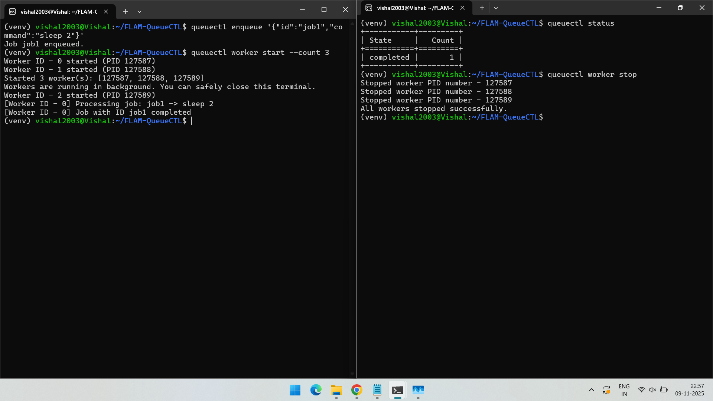
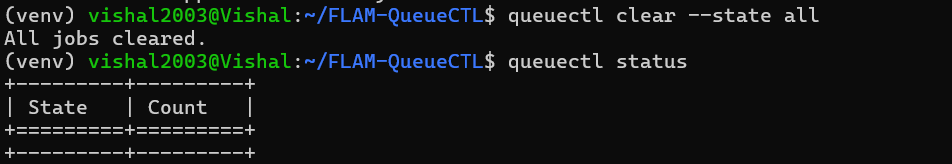

# QueueCTL - Background Job Queue System

QueueCTL is a CLI-based background job queue system built in Python.
It manages background jobs, executes them through worker processes, retries failed jobs with exponential backoff, and moves permanently failed jobs to a Dead Letter Queue (DLQ).
Job data is persisted in SQLite, allowing recovery across restarts.

## 1. Features

- Enqueue and execute background jobs
- Multiple worker processes
- Automatic retries with exponential backoff
- Dead Letter Queue (DLQ) for failed jobs
- Persistent storage using SQLite
- Graceful worker stop/start
- CLI-based configuration and management

## 2. Setup Instructions
### Prerequisites
- Python 3.9 or higher
- SQLite (included with Python)
Installation
```bash
$ git clone <github clone link>.git
$ cd QueueCTL
$ python3 -m venv venv
$ source venv/bin/activate      # On Windows: venv\Scripts\activate
$ pip install -r requirements.txt
$ pip install -e .
```

## 3. Usage Examples
Below are the supported commands and their purposes.
Add your screenshots after each section.

### 1. Enqueue a Job

Adds a new job to the queue.
```bash
$ queuectl enqueue '{"id":"job1","command":"echo Hello World"}'
```

#### Description:
Creates a job with the provided command and adds it to the queue for processing.

#### Screenshot:


### 2. Start Workers

Starts one or more worker processes to process queued jobs.
```bash
$ queuectl worker start --count 3
```

#### Description:
Starts three worker processes in the background.
Each worker picks jobs from the queue and executes them.

#### Screenshot:


### 3. Stop Workers

Stops all currently running workers.
```bash
$ queuectl worker stop
```

#### Description:
Stops all worker processes gracefully after finishing current tasks.

#### Screenshot:



### 4. Check Queue Status

Displays a summary of jobs by state and the number of active workers.
```bash
$ queuectl status
```

#### Description:
Shows the number of jobs in pending, processing, completed, failed, and dead states.

#### Screenshot:


### 5. List Jobs by State

Lists jobs in a specific state (e.g., pending, completed, dead).
```bash
$ queuectl list --state pending
```

#### Description:
Lists all jobs that are currently waiting for processing.

#### Screenshot:


### 6. Dead Letter Queue (DLQ)

View DLQ Jobs
```bash
$ queuectl dlq list
```

#### Description:
Displays all jobs that have failed permanently and moved to the DLQ.

#### Screenshot:


Retry DLQ Job
```bash
$ queuectl dlq retry <job_id>
```

#### Description:
Retries a failed job from the DLQ by moving it back to the pending queue.

#### Screenshot:


### 7. Configuration Management

Modify runtime configuration such as retry count and backoff base.
```bash
$ queuectl config set max_retries 3
```

#### Description:
Updates configuration values stored persistently for workers and retry logic.

#### Screenshot:


### 8. Clear Jobs

Removes jobs from the database by state or clears everything.
```bash
$ queuectl clear --state all
$ queuectl clear --state completed
$ queuectl clear --state dead
```

#### Description:
Clears job entries from the SQLite database without deleting the file.

#### Screenshot:



## 4. Architecture Overview

### Job Lifecycle:

### State	Description
- pending	Waiting to be picked by a worker
- processing	Currently executing
- completed	Successfully executed
- failed	Failed but will retry
- dead - Permanently failed and moved to DLQ

### Core Components:

a) queuectl/cli.py – Command-line interface

b) queuectl/db.py – SQLite-based job storage

c) queuectl/worker.py – Worker process logic

d) queuectl/job.py – Job creation and handling

e) queuectl/config.py – Configuration management


## 5. Testing Instructions

Enqueue a successful job:
```bash
$ queuectl enqueue '{"id":"job1","command":"echo Success"}'
$ queuectl worker start --count 1
```

Expected: Job moves to completed.

Enqueue a failing job:
```bash
$ queuectl enqueue '{"id":"fail_job","command":"exit 1","max_retries":2}'
```

Expected: Job retries twice, then moves to DLQ.

Retry the DLQ job:
```bash
$ queuectl dlq retry fail_job
```

Expected: Job moves back to pending.

Clear jobs:
```bash
$ queuectl clear --state all
```

Expected: All jobs are removed from storage.

## 6. Demo Video

Add your CLI demo video link below:

Google Drive Demo Link:
https://drive.google.com/drive/folders/1eKtAEjsQ9_46i1LkbF1PeVznpNoybRwY?usp=drive_link

## 7. Assumptions & Trade-offs

- SQLite is sufficient for persistence; not designed for large-scale distributed environments.
- Workers are local processes (no remote/distributed execution).
- Commands are shell-based and executed using Python’s subprocess.
- Job timeout and scheduling are not implemented (future enhancements possible).

## 8. Future Enhancements

- Scheduled or delayed job execution (run_at)
- Job priority queue
- Timeout and cancellation support
- Job output logging
- Web dashboard for monitoring

